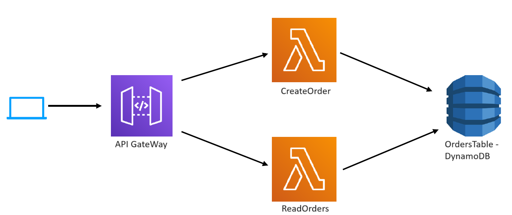
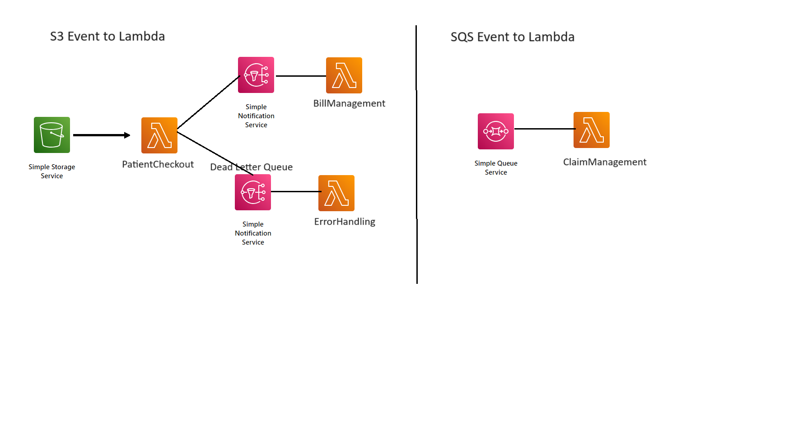

# AWS Serverless Lambda Projects

This repository contains multiple small AWS Serverless Lambda projects, each organized into its respective folder. These projects are designed to provide a hands-on understanding of various aspects of AWS Serverless computing and help you grasp the overall picture of AWS serverless architecture.

## Project Structure

The repository structure is organized as follows:

### FirstLambda

The `firstlambda` project serves as an introduction to AWS Lambda basics. It demonstrates basic Lambda function execution, showcasing different data types as input and output. This project was created using `sam init` with the "HelloWorld" function template.

### ordersapi

The `ordersapi` project is implemented as an AWS Lambda function triggered by API Gateway events. It includes two distinct REST APIs - one for creating orders and another for reading orders. Data is stored in DynamoDB for persistence.

### patientcheckout

The Patient Checkout System, built with AWS Serverless Application Model (SAM), leverages the following AWS services:

S3: Storage for patient-related data, triggering the PatientCheckoutFunction on object creation events.

Lambda: Serverless functions (PatientCheckoutFunction, BillManagementFunction, ErrorHandlingFunction, ClaimManagementFunction) for various aspects of the Patient Checkout System.

SNS: Notification service with PatientCheckoutTopic for event publishing and PatientCheckoutDLQ as a Dead Letter Queue for error handling in PatientCheckoutFunction.

SQS: Queue service with ClaimManagementQueue for efficient claim management.

IAM Policies: Permissions granted through IAM policies (S3ReadPolicy, SNSPublishMessagePolicy) attached to Lambda functions.

