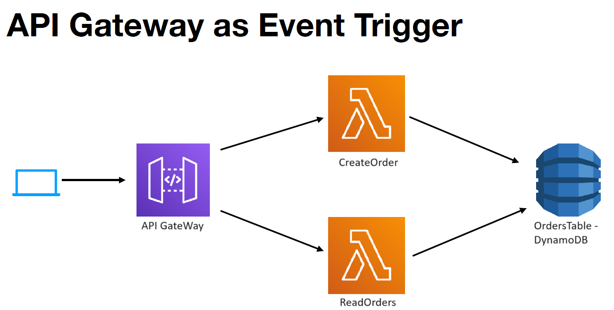

# Orders API using AWS SAM

This project implements an Orders API using AWS Serverless Application Model (SAM).

## Table of Contents

- [Prerequisites](#prerequisites)
- [SAM Template Overview](#sam-template-overview)
- [Project Structure](#project-structure)
- [Deployment](#deployment)
- [API Endpoints](#api-endpoints)

## Prerequisites

Before deploying the Orders API, ensure you have the following:

- [AWS SAM CLI](https://docs.aws.amazon.com/serverless-application-model/latest/developerguide/serverless-sam-cli-install.html) installed.
- Java 11 runtime environment.
- [Docker](https://www.docker.com/) needs to be installed.

## SAM Template Overview

The SAM template (`template.yaml`) defines the AWS resources needed for the Orders API. It includes a DynamoDB table for storing orders, Lambda functions for creating and reading orders, and API Gateway configurations.

### Resources

- [OrdersTable](#orderstable): DynamoDB table for storing orders.
- [CreateOrderFunction](#createorderfunction): Lambda function for creating orders.
- [ReadOrdersFunction](#readordersfunction): Lambda function for reading orders.

For more details, refer to the [template.yaml](template.yaml) file.

## Project Structure

## Deployment

To deploy the Orders API, run the following commands in your terminal:
sam build
sam deploy --guided

## API Endpoints

After deployment, the following API endpoints will be available:

Create Order: POST /orders
Read Orders: GET /orders
Replace ${ServerlessRestApi} in the endpoint URLs with the actual value.
