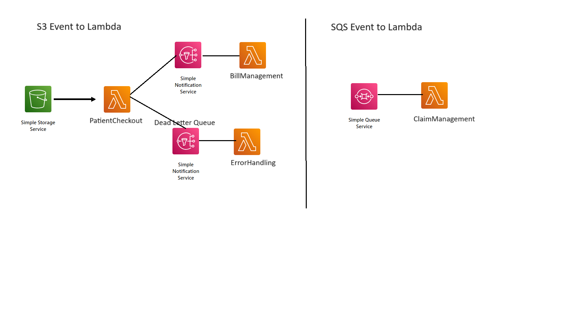
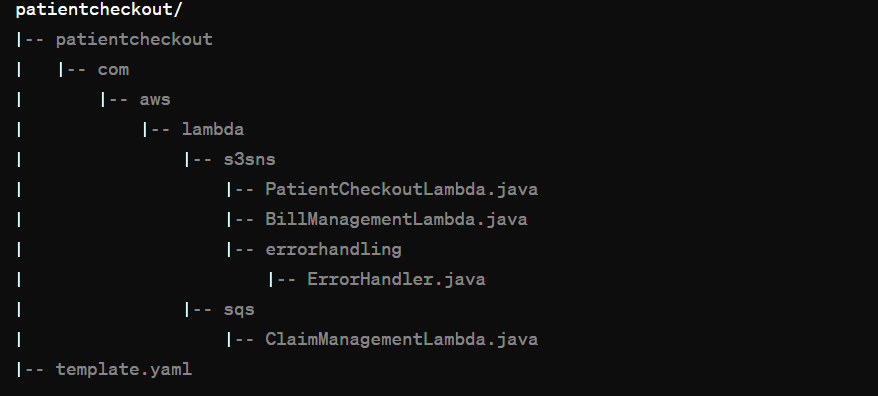

# Patient Checkout System using AWS SAM



## Table of Contents

- [Overview](#overview)
- [Prerequisites](#prerequisites)
- [Project Structure](#project-structure)
- [Deployment](#deployment)
- [Functionality](#functionality)
  - [Patient Checkout Function](#patient-checkout-function)
  - [Bill Management Function](#bill-management-function)
  - [Error Handling Function](#error-handling-function)
  - [Claim Management Function](#claim-management-function)

## Overview

The Patient Checkout System, built with AWS Serverless Application Model (SAM), leverages the following AWS services:

- **S3:** Storage for patient-related data, triggering the `PatientCheckoutFunction` on object creation events.

- **Lambda:** Serverless functions (`PatientCheckoutFunction`, `BillManagementFunction`, `ErrorHandlingFunction`, `ClaimManagementFunction`) for various aspects of the Patient Checkout System.
  
- **SNS:** Notification service with `PatientCheckoutTopic` for event publishing and `PatientCheckoutDLQ` as a Dead Letter Queue for error handling in `PatientCheckoutFunction`.

- **SQS:** Queue service with `ClaimManagementQueue` for efficient claim management.

- **IAM Policies:** Permissions granted through IAM policies (`S3ReadPolicy`, `SNSPublishMessagePolicy`) attached to Lambda functions.


## Prerequisites

Before deploying the Patient Checkout System, ensure you have the following:

- [AWS CLI](https://aws.amazon.com/cli/) installed and configured.
- [AWS SAM CLI](https://docs.aws.amazon.com/serverless-application-model/latest/developerguide/serverless-sam-cli-install.html) installed.
- [Java 11 runtime environment](https://www.oracle.com/java/technologies/javase-jdk11-downloads.html).
- [Docker](https://www.docker.com/) needs to be installed to execute `sam build`.

Ensure that Docker is running and accessible in your environment.

### Project Structure



### Deployment

To deploy the Patient Checkout System, run the following commands in your terminal:

```bash
sam build
sam deploy --guided